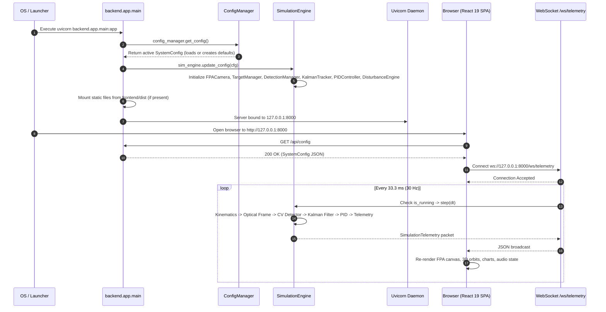
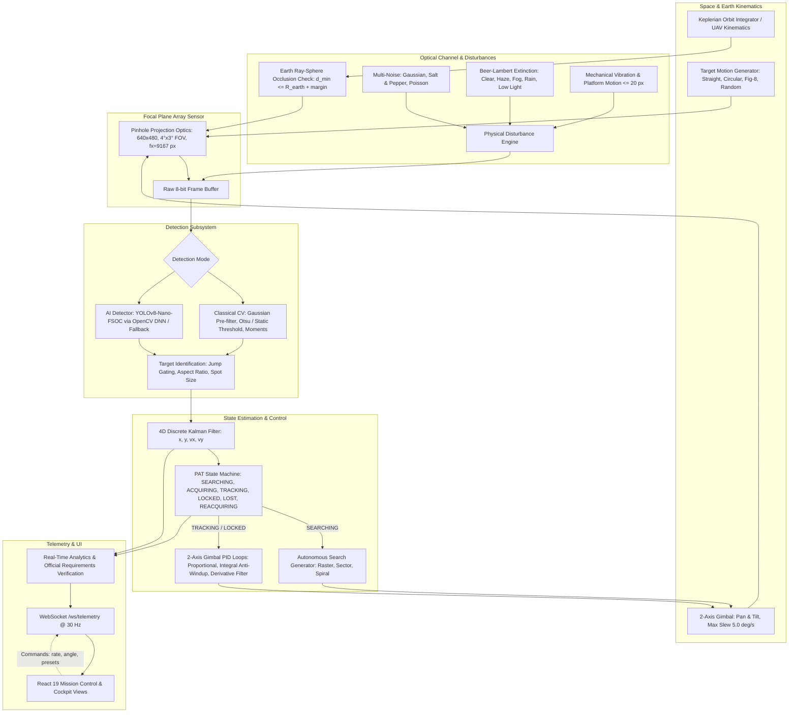

# PROJECT_CONTEXT.md — Comprehensive Project Handover & System Knowledge Base

> **Target Audience**: AI coding assistants and software engineers with zero prior context.  
> **Rule of Truth**: If this document and the actual codebase disagree, **trust the code** and update this document.  
> **Security Mandate**: Never store secrets, private tokens, or real API keys in this document.

---

## 1. Project Overview

### 1.1 Purpose & Problem Solved
The **AI-Based Virtual Camera Tracking System for Mobile Free Space Optical Communication (FSOC) Terminals** (project codename: **Vision** / **LaserLockAI**) is an aerospace-grade, real-time digital twin, physical optical disturbance testbench, closed-loop Pointing, Acquisition, and Tracking (PAT) coarse alignment simulator, and decoupled MP4 video flight benchmark evaluator.

In mobile FSOC applications (satellites, UAVs, naval vessels, terrestrial vehicles), high-bandwidth optical communications require sub-milliradian pointing precision over long distances ($10\text{ km}$ to $>40,000\text{ km}$). Before fine-steering mirrors (FSM) can close the optical link, a wide Field-of-View (FOV) gimbal-mounted camera must:
1. Search and acquire an optical beacon emitting across an uncertain angular zone.
2. Reject sensor noise, false bright glints, cloud edges, and solar reflections.
3. Smooth kinematic jitter and maintain state estimation during optical fading or cloud occlusion.
4. Drive a 2-axis Pan/Tilt gimbal closed-loop to achieve and hold coarse boresight alignment within a tight $\le 10.0\text{ pixel}$ error tolerance at $\ge 20\text{ FPS}$ within $\le 2.0\text{ seconds}$.

This project solves this challenge entirely in software without requiring expensive physical gimbal hardware, providing:
- A $2000 \times 2000 \times 2000$ 3D virtual environment with pinhole camera optics ($640 \times 480$ FPA sensor, $4.0^\circ \times 3.0^\circ$ FOV).
- A multi-tier orbital mechanics simulation supporting LEO, MEO, GEO, GTO, and UAV platforms with Earth-blocking line-of-sight (LOS) occlusion and co-orbital satellite handover.
- A physical optical disturbance engine (Gaussian, Salt & Pepper, Poisson, camera vibration, platform motion, Beer-Lambert atmospheric attenuation, motion blur, and temporal occlusion).
- A decoupled MP4 benchmark suite evaluating video flight sequences with ground-truth verification and automated PDF, CSV, Markdown, and JSON reporting.

### 1.2 Target Users
- Free Space Optical Communication (FSOC) & Lasercom Systems Engineers.
- Pointing, Acquisition, and Tracking (PAT) Control Algorithm Developers.
- Computer Vision & Edge AI Engineers optimizing spot detection and clutter rejection.
- Independent evaluators and certifying authorities assessing compliance against official Problem Statement 4 specifications.

### 1.3 Scope Note
- An installer exists in the `electron/` directory for packaging the application into a standalone Windows desktop executable using Electron and NSIS.

### 1.4 Current Project Status
- **Overall Status**: **Working and Fully Functional**.
- **Official Acceptance Suite**: 31 of 31 acceptance steps passed (`tests/test_final_acceptance.py`).
- **Regression Suite**: 97 of 97 automated pytest tests passing across all functional parts.
- **Backend API**: All REST endpoints and WebSocket telemetry stream operating synchronously and asynchronously.
- **Frontend SPA**: All 16 engineering views rendered in React 19 / Vite / TailwindCSS with dual 2D/3D Three.js viewports and Web Audio alarm telemetry.
- **AI Neural Weights**: AI detector architecture is operational via OpenCV DNN; when optional `.onnx` model weights are absent, it transparently executes a verified Classical CV fallback without fabricating results.

---

## 2. Tech Stack

### 2.1 Backend (Python)
| Technology / Library | Version Constraint | Exact Role in Project |
| :--- | :--- | :--- |
| **Python** | `>= 3.10` (tested on 3.11 & 3.13) | Core programming language |
| **FastAPI** | `>= 0.110.0` | Asynchronous REST API routing, OpenAPI docs, and static SPA serving |
| **Uvicorn[standard]** | `>= 0.28.0` | High-performance ASGI web server daemon |
| **Pydantic** | `>= 2.6.0` | Strict schema validation, data serialization, and configuration models |
| **NumPy** | `>= 1.24.0` | Vectorized numerical operations, noise arrays, kinematic state matrices |
| **OpenCV (`opencv-python`)** | `>= 4.8.0` | Image processing, contour detection, moments calculation, video decoding |
| **Websockets** | `>= 12.0` | 30 Hz real-time bidirectional telemetry streaming |
| **ReportLab** | `>= 4.0.0` | Automated enterprise PDF performance report generation |
| **Requests** | `>= 2.31.0` | HTTP client for standalone release and GitHub asset uploading |
| **Pytest** | `>= 8.0.0` | Comprehensive unit, integration, and acceptance test execution |

### 2.2 Frontend (TypeScript & React)
| Technology / Library | Version (from package.json) | Exact Role in Project |
| :--- | :--- | :--- |
| **React** | `^19.0.0` | Reactive UI view layer |
| **React-DOM** | `^19.0.0` | Web DOM rendering |
| **TypeScript** | `~5.7.3` | Strict static typing for all state, props, and API models |
| **Vite** | `^6.2.0` | High-speed frontend build tool and development server |
| **TailwindCSS** | `^4.0.9` | Utility-first responsive styling |
| **@tailwindcss/vite** | `^4.0.9` | TailwindCSS v4 Vite integration plugin |
| **Three.js** | `^0.186.1` | WebGL 3D simulation scenes (Earth globe, orbits, satellite bodies) |
| **@types/three** | `^0.186.0` | TypeScript definitions for Three.js |
| **Recharts** | `^2.15.1` | Real-time telemetry time-series charting (errors, FPS, latency, angles) |
| **Lucide React** | `^1.16.0` | Consistent iconography across navigation and cockpit panels |

### 2.3 Storage & Persistence
- **No external SQL/NoSQL database service required.**
- **Active Configuration**: `backend/saved_configs/active_config.json` (JSON).
- **Experimental Records**: `backend/data/experiments.json` (JSON).
- **Archived Reports**: `backend/data/reports/` and `reports_archive/` (JSON, Markdown, CSV, PDF).
- **Client Settings**: Browser `localStorage` (keys: `laserlockAI_sceneSettings_v3`, `laserlockAI_alarm_muted`, `laserlockAI_sidebar_collapsed`).

---

## 3. Folder & File Structure

```
Vision-main/
├── .gitignore                          # Git ignore rules for node_modules, build outputs, logs, pycache
├── PROJECT_CONTEXT.md                  # Unified single-source-of-truth project handover document
├── README.md                           # Technical manual, architecture diagrams, and problem specification
├── build_exe.bat                       # Windows batch script triggering complete build pipeline
├── build_exe.ps1                       # PowerShell 6-step build orchestrator (PyInstaller + Vite + Electron)
├── package_standalone.py               # Distribution bundler producing self-contained dist_standalone/
├── pytest.ini                          # Pytest configuration specifying test paths and warning filters
├── release_exe.ps1                     # PowerShell script publishing GitHub releases and uploading installer
├── requirements.txt                    # Production Python package dependencies with minimum versions
├── run_application.bat                 # Windows 1-click double-clickable launcher
├── run_application.py                  # Python application entry point: checks bundle, launches server and browser
├── upload_github_release.py            # Streaming multi-part/curl GitHub Release uploader for large binaries
│
├── backend/                            # Complete Python backend application package
│   ├── __init__.py                     # Root backend package identifier
│   ├── saved_configs/
│   │   └── active_config.json          # Persisted active system configuration
│   ├── data/
│   │   ├── experiments.json            # Persisted benchmark experiment records
│   │   └── reports/                    # Generated performance reports (JSON, MD, CSV)
│   └── app/                            # Core application source tree
│       ├── __init__.py                 # Application package identifier
│       ├── main.py                     # FastAPI application factory, CORS, static SPA routing, startup hooks
│       ├── api/                        # HTTP and WebSocket endpoint controllers
│       │   ├── __init__.py
│       │   ├── routes.py               # Primary REST API (status, config, sim, gimbal, benchmark, orbital)
│       │   └── websocket.py            # WebSocket telemetry server at /ws/telemetry (30 Hz broadcast)
│       ├── analytics/                  # Performance measurement & algorithm benchmarking
│       │   ├── __init__.py
│       │   ├── experiment_engine.py    # Multi-algorithm comparison and trial storage
│       │   └── metrics_base.py         # Real-time metrics accumulator (RMSE, acquisition time, loss rate)
│       ├── benchmark/                  # Independent MP4 video evaluation pipeline
│       │   ├── __init__.py
│       │   ├── synthetic_generator.py  # Mathematical 30 FPS MP4 video and ground-truth generator
│       │   └── video_pipeline.py       # PTZ-bypassed video frame decoder and centroid evaluation engine
│       ├── camera/                     # Sensor and optics modeling
│       │   ├── __init__.py
│       │   └── fpa_camera.py           # 640x480 Focal Plane Array, pinhole projection, pan/tilt gimbal
│       ├── config/                     # Configuration lifecycle management
│       │   ├── __init__.py
│       │   ├── defaults.py             # Official Problem Statement 4 default parameters
│       │   └── manager.py              # ConfigManager singleton managing JSON serialization and reset
│       ├── control/                    # Gimbal feedback control and scan patterns
│       │   ├── __init__.py
│       │   ├── controller_base.py      # Abstract gimbal controller interface
│       │   ├── pid_controller.py       # 2-Axis discrete PID controller with anti-windup and filtering
│       │   └── search_pattern.py       # Autonomous scan generators (Raster, Sector, Spiral)
│       ├── demo/                       # Automated demonstration orchestrator
│       │   ├── __init__.py
│       │   ├── demo_orchestrator.py    # 14-step Simulation and 7-step Video demonstration state machine
│       │   ├── handover_demo.py        # Co-orbital satellite handover demo executor
│       │   └── handover_report.json    # Cached handover benchmark evaluation results
│       ├── detection/                  # Computer vision and AI spot localization
│       │   ├── __init__.py
│       │   ├── ai_detector.py          # OpenCV DNN neural detector with honest Classical CV fallback
│       │   ├── cv_detector.py          # OpenCV moments centroiding, Otsu binarization, intrinsic calibration
│       │   ├── detection_manager.py    # Common interface coordinating all 4 detection modes
│       │   ├── detector_base.py        # Abstract detection dataclasses (Detection, DetectionResult)
│       │   ├── kalman_filter.py        # 4D discrete linear Kalman filter ([x, y, vx, vy])
│       │   └── target_identifier.py    # Multi-criteria false bright object (clutter) rejection engine
│       ├── disturbances/               # Physical noise and environmental modeling
│       │   ├── __init__.py
│       │   ├── disturbance_base.py     # Base disturbance abstractions
│       │   └── optical_disturbance_engine.py # Multi-noise, jitter, Beer-Lambert atmosphere, motion blur
│       ├── models/                     # Pydantic data schemas
│       │   ├── __init__.py
│       │   ├── analytics_model.py      # TelemetryPoint, PerformanceMetrics, OfficialRequirementStatus
│       │   ├── benchmark_model.py      # VideoMetadata, GroundTruthPoint, FrameBenchmarkLog, BenchmarkResults
│       │   ├── config_model.py         # SystemConfig, CameraConfig, TargetConfig, MotionConfig, DisturbanceConfig
│       │   ├── report_model.py         # PerformanceReport, RawFrameLogEntry, DemoStatusResponse
│       │   └── telemetry_model.py      # SimulationTelemetry, TargetState, CameraState, TrackingTelemetry
│       ├── orbital/                    # Space-to-space & space-to-ground orbital mechanics
│       │   ├── __init__.py
│       │   ├── constants.py            # Astronomical and Earth constants (GM, Earth radius, presets)
│       │   ├── handover.py             # 2-Satellite co-orbital handover state machine and metrics
│       │   ├── link_geometry.py        # Vector LOS, Earth ray-sphere occlusion, atmospheric path fraction
│       │   ├── orbital_mechanics.py    # Circular & Keplerian orbit integrators and UAV topocentric motion
│       │   ├── platform.py             # Platform state (ECI position/velocity, attitude, body vectors)
│       │   ├── scenario.py             # Top-level orbital scenario controller and telemetry producer
│       │   └── validation_suite.py     # Multi-orbit numerical validation suite against physical invariants
│       ├── reports/                    # Automated certification and documentation generator
│       │   ├── __init__.py
│       │   ├── report_base.py          # Base report generation interface
│       │   ├── report_generator.py     # PDF (ReportLab), Markdown, HTML, and CSV multi-format compiler
│       │   └── technical_documentation.py # 23-section technical manual and 14-chapter user guide repository
│       ├── simulation/                 # Simulation orchestration core
│       │   ├── __init__.py
│       │   ├── engine.py               # Central SimulationEngine coordinating all subsystems at 30 Hz
│       │   └── environment.py          # 2000x2000 3D spatial coordinate boundaries
│       └── target/                     # Optical beacon kinematics
│           ├── __init__.py
│           ├── beacon.py               # BeaconTarget spot renderer (Square, Circle, Gaussian) and TargetManager
│           └── motion_generators.py    # 8 Trajectory generators (Straight Line, Circle, Fig 8, Random, etc.)
│
├── frontend/                           # React 19 + TypeScript + Vite frontend client
│   ├── index.html                      # Single Page Application HTML host document
│   ├── package.json                    # Frontend dependencies and build scripts
│   ├── tsconfig.json                   # Root TypeScript compiler configuration
│   ├── tsconfig.app.json               # Application-specific TypeScript compilation settings
│   ├── tsconfig.node.json              # Vite configuration TypeScript compilation settings
│   ├── vite.config.ts                  # Vite bundler configuration with backend proxy rules
│   ├── public/                         # Static public assets served directly
│   │   ├── favicon.svg                 # Application favicon
│   │   ├── icons.svg                   # Navigation iconography
│   │   └── textures/earth/             # High-resolution photographic Earth textures
│   │       ├── earth_day_2048.jpg      # 2048x1024 day landmass and ocean photographic map
│   │       ├── earth_clouds_1024.png   # 1024x512 transparent cloud layer
│   │       ├── earth_lights_2048.png   # 2048x1024 night city lights emissive map
│   │       ├── earth_normal_2048.jpg   # 2048x1024 surface terrain normal relief map
│   │       └── earth_specular_2048.jpg # 2048x1024 ocean water specular reflectivity map
│   └── src/                            # Frontend application source code
│       ├── main.tsx                    # React application bootstrap entry point
│       ├── App.tsx                     # Top-level navigation shell, cockpit toolbar, and page router
│       ├── App.css                     # Global component layout styles
│       ├── index.css                   # TailwindCSS directives and base themes
│       ├── assets/                     # Packaged static assets
│       ├── charts/
│       │   └── TelemetryChart.tsx      # High-performance Recharts real-time time-series visualizer
│       ├── components/
│       │   └── BeaconSpeedControl.tsx  # Physical speed slider component (km/h and px/s)
│       ├── hooks/
│       │   ├── useSceneSettings.ts     # React hook providing synchronized 3D scene parameters
│       │   └── useTelemetry.ts         # WebSocket hook with auto-reconnection and HTTP polling fallback
│       ├── pages/                      # 16 Specialized Engineering Views
│       │   ├── AnalyticsPage.tsx       # Live time-series charts for error, latency, FPS, and jitter
│       │   ├── ArchitecturePage.tsx    # 10-part system pipeline diagrams and topological charts
│       │   ├── CameraViewPage.tsx      # Calibrated 640x480 FPA camera view with reticles and error HUD
│       │   ├── DemoModal.tsx           # Interactive modal tracking autonomous demonstration steps
│       │   ├── DetectionAIPage.tsx     # Computer vision tuning, Otsu toggle, and AI model inspector
│       │   ├── DisturbancesPage.tsx    # Multi-noise generator, atmospheric models, and vibration controls
│       │   ├── DocumentationPage.tsx   # Integrated 23-section technical manual viewer
│       │   ├── ExperimentsPage.tsx     # Automated parameter sweeps and Monte Carlo repeatability tests
│       │   ├── MissionControlPage.tsx  # Flight operations cockpit with dual synchronized viewports
│       │   ├── PerformanceReportsPage.tsx # Report generator, multi-format export buttons, and log tables
│       │   ├── RequirementsPage.tsx    # Live compliance audit table validating PS4 criteria
│       │   ├── SettingsPage.tsx        # System configuration editor, JSON export/import, factory reset
│       │   ├── TargetEnvironmentPage.tsx # Target geometry, 3D kinematics, and radar display
│       │   ├── TrackingControlPage.tsx # 6-state PAT state machine visualizer and PID gain sliders
│       │   ├── VideoBenchmarkPage.tsx  # MP4 video player, batch processor, and ground-truth comparison
│       │   └── VirtualSimulationPage.tsx # 2000x2000 3D spatial canvas with ray-traced FOV cone
│       ├── services/
│       │   ├── alarmAudio.ts           # Web Audio API synthesized glass-cockpit chime and loss alarm
│       │   └── api.ts                  # Typed Fetch HTTP client mapping all backend endpoints
│       ├── simulation/                 # 3D Viewports & Three.js Canvas Subsystems
│       │   ├── earthTexture.ts         # High-definition canvas texture generator (procedural & photographic)
│       │   ├── FPACameraViewport.tsx   # 2D Canvas rendering raw sensor pixels, overlays, and reticles
│       │   ├── HandoverPanel.tsx       # Satellite handover status, active/backup telemetry, and controls
│       │   ├── OrbitalControlsPanel.tsx# Keplerian element sliders, altitude pickers, and orbit presets
│       │   ├── OrbitalScene3DViewport.tsx # Three.js Earth sphere, orbit paths, and satellite 3D bodies
│       │   ├── OrbitalTelemetryPanel.tsx # Range, elevation, azimuth, and line-of-sight status readout
│       │   ├── satelliteModel.ts       # Procedural 3D satellite mesh (GaAs solar wings, gold MLI foil)
│       │   ├── satellitePovSync.ts     # Synchronizer linking 3D world kinematics to camera viewport
│       │   ├── Scene3DViewport.tsx     # Interactive Three.js orbital scene renderer
│       │   └── VirtualSceneCanvas.tsx  # 2D top-down Cartesian radar map of 2000x2000 world space
│       ├── stores/
│       │   └── sceneSettingsStore.ts   # LocalStorage-backed reactive settings store
│       └── types/
│           └── index.ts                # TypeScript interfaces matching all backend Pydantic models
│
├── docs/                               # Engineering documentation & specifications
│   ├── ARCHITECTURE.md                 # System topological diagrams and coordinate frame definitions
│   ├── PROBLEM_STATEMENT_4_SPEC.md     # Official Problem Statement 4 parameters and requirements table
│   └── SETUP_GUIDE.md                  # Quickstart execution commands and verification checklist
│
├── benchmark_videos/                   # Standard flight evaluation MP4 videos & ground truth
│   ├── final_acceptance_flight_trajectory_30fps.mp4
│   ├── final_acceptance_flight_trajectory_gt.csv
│   ├── final_acceptance_flight_trajectory_gt.json
│   ├── official_precision_flight_pattern_30fps.mp4
│   ├── official_precision_flight_pattern_gt.csv
│   ├── official_precision_flight_pattern_gt.json
│   ├── straight_line_traverse_30fps.mp4
│   ├── straight_line_traverse_gt.csv
│   └── straight_line_traverse_gt.json
│
└── tests/                              # Automated test and verification suite
    ├── test_api.py                     # API readiness, configuration, and simulation endpoint tests
    ├── test_config.py                  # Problem Statement 4 parameter constraint validation
    ├── test_final_acceptance.py        # 31-step complete final system integration acceptance protocol
    ├── test_handover.py                # Multi-satellite handover state machine and visibility tests
    ├── test_local_regression.py        # Local 2000m kinematic trajectory regression tests
    ├── test_orbital_api.py             # Orbital configuration API and altitude constraint tests
    ├── test_orbital_physics.py         # Orbital velocity, period, and Earth occlusion physics tests
    ├── test_part2.py                   # 3D projection, FOV calculations, and gimbal limits tests
    ├── test_part3.py                   # Sensor binarization, moments centroiding, and SNR tests
    ├── test_part4.py                   # Multi-detection architecture and clutter rejection tests
    ├── test_part5.py                   # Closed-loop PID, PAT state machine, and Kalman tests
    ├── test_part6.py                   # Multi-noise engine, atmospheric models, and jitter tests
    ├── test_part7.py                   # MP4 video benchmark, PTZ bypass, and playback tests
    ├── test_part8.py                   # Real-time analytics, 5-algorithm comparison tests
    ├── test_part9.py                   # Multi-format report exports and demonstration orchestrator tests
    ├── test_simulation.py              # Discrete step physics and pinhole projection tests
    └── verify_live_part2.py .. part9.py# Step-by-step interactive live verification scripts
```

---

## 4. Entry Points & Startup Flow

### 4.1 Launch Scripts
1. **Windows 1-Click**: `run_application.bat`
   - Invokes `python run_application.py`.
2. **Direct CLI Launch**: `python run_application.py`
   - Verifies whether the production frontend bundle exists at `frontend/dist/index.html`.
   - If missing, executes `npm run build` inside `frontend/`.
   - Spawns a background thread that sleeps 1.5 seconds and opens the default browser to `http://127.0.0.1:8000`.
   - Launches the Uvicorn ASGI server hosting `backend.app.main:app` on port 8000.
3. **Developer Split Launch**:
   - Backend: `python -m uvicorn backend.app.main:app --host 127.0.0.1 --port 8000 --reload`
   - Frontend: `cd frontend && npm run dev` (running on `http://localhost:5173`, proxying `/api` and `/ws` to port 8000).

### 4.2 Step-by-Step Startup Flow



---

## 5. Architecture & Data Flow

### 5.1 System Architecture Diagram



### 5.2 Video Benchmark Data Flow (PTZ Bypass)
In Video Benchmark Mode, the virtual environment and PTZ gimbal are bypassed completely:
```
[MP4 Video File] ──► [OpenCV VideoCapture] ──► [640x480 Frame]
                                                    │
                                                    ▼
                                      [Detection Subsystem (CV / AI)]
                                                    │
                                                    ▼
                                      [Optical Centroid (u, v)]
                                                    │
                                                    ▼
                                      [Discrete Kalman Tracker]
                                                    │
                                                    ▼
[Ground Truth Reference (CSV/JSON)] ──► [Error Comparator (Euclidean, RMSE, Latency)]
                                                    │
                                                    ▼
                                      [Benchmark Report & Multi-Format Exports]
```

---

## 6. Module-by-Module Explanation

### 6.1 Backend Core Modules

#### `backend/app/main.py`
- **Purpose**: Application factory and root server.
- **Key Functions / Objects**:
  - `app = FastAPI(...)`: Configures Swagger docs (`/docs`), ReDoc (`/redoc`), and CORS.
  - `startup_event()`: Loads active configuration via `config_manager` and synchronizes `sim_engine`.
  - `serve_index_or_root()` and `serve_spa(full_path)`: Serves production frontend assets from `VISION_FRONTEND_DIST` or `frontend/dist/`.
- **Inputs / Outputs**: Handles HTTP requests; outputs JSON responses and HTML/JS bundles.
- **Dependencies**: Depends on `routes.py`, `websocket.py`, `config/manager.py`, `simulation/engine.py`.
- **Depended on by**: `run_application.py`, `uvicorn`.

#### `backend/app/simulation/engine.py`
- **Purpose**: Core real-time discrete simulation loop coordinator.
- **Key Classes**:
  - `SimulationEngine`: Owns camera, target manager, detector, tracker, PID controller, disturbance engine, analytics, and orbital scenario.
- **Key Methods**:
  - `step(dt: Optional[float] = None) -> SimulationTelemetry`: Advances target kinematics, projects optics, synthesizes image disturbances, segments beacon centroid, executes Kalman filtering and PAT state transitions, computes PID rate commands, updates analytics, and packages a complete telemetry snapshot.
  - `generate_raw_fpa_frame(dt) -> np.ndarray`: Synthesizes the actual 8-bit $640 \times 480$ camera frame.
  - `render_fpa_frame(annotated: bool) -> np.ndarray`: Draws HUD overlays, crosshairs, bounding boxes, and error vectors.
  - `set_gimbal_target_angles(pan, tilt)`: Sets commanded slider setpoints.
  - `set_manual_gimbal_rates(pan_rate, tilt_rate)`: Applies manual nudge rate commands.
- **Dependencies**: `fpa_camera.py`, `beacon.py`, `detection_manager.py`, `kalman_tracker.py`, `pid_controller.py`, `optical_disturbance_engine.py`, `metrics_base.py`, `orbital/scenario.py`.
- **Depended on by**: `main.py`, `routes.py`, `websocket.py`, `demo_orchestrator.py`.

#### `backend/app/camera/fpa_camera.py`
- **Purpose**: Calibrated pinhole optics and 2-axis Pan/Tilt gimbal actuator dynamics.
- **Key Classes**:
  - `FPACamera`: Simulates $640 \times 480$ focal plane array, $4.0^\circ \times 3.0^\circ$ FOV, and mechanical gimbal.
- **Key Equations**:
  - Focal lengths: $f_x = \frac{W / 2}{\tan(\text{FOV}_h / 2)} = \frac{320}{\tan(2^\circ)} \approx 9167.3\text{ px}$; $f_y = \frac{H / 2}{\tan(\text{FOV}_v / 2)} = \frac{240}{\tan(1.5^\circ)} \approx 9167.3\text{ px}$.
  - Coordinate Transform: $\mathbf{r}_c = \mathbf{R}_x(\theta_{\text{tilt}}) \mathbf{R}_y(-\psi_{\text{pan}}) (\mathbf{p}_w - \mathbf{c}_w)$.
  - Pin-hole Projection: $u = c_x + f_x \frac{X_c}{Z_c}$, $v = c_y - f_y \frac{Y_c}{Z_c}$.
  - Orbital Projection Scale: Linear $160\text{ px/deg}$ mapping ($u = 320 + \Delta\text{az} \times 160$, $v = 240 - \Delta\text{el} \times 160$).
  - Actuator Limits: Pan $[-180^\circ, +180^\circ]$, Tilt $[-85^\circ, +85^\circ]$, Max slew rate $5.0^\circ/\text{s}$.
- **Dependencies**: `math`, `numpy`, `models/config_model.py`.
- **Depended on by**: `simulation/engine.py`, `detection/cv_detector.py`.

#### `backend/app/target/beacon.py` & `motion_generators.py`
- **Purpose**: Optical beacon physical spot rendering and 3D kinematics generation.
- **Key Classes**:
  - `BeaconTarget`: Maintains $(x, y, z, v_x, v_y, v_z, a_x, a_y, a_z)$. Renders Square (default $10 \times 10\text{ px}$ flat-top), Circle (Airy disk), or Gaussian beam profiles onto NumPy frames with subpixel placement.
  - `TargetManager`: Manages 1 to $N$ targets and handles reset/updates.
  - `BaseTrajectory` and 8 Subclasses:
    1. `StraightLineTrajectory`: Constant velocity linear traversal with boundary bounce.
    2. `CircularTrajectory`: Circular orbit in XY plane.
    3. `FigureOf8Trajectory`: Lissajous figure-of-eight ($x = A \sin(\omega t), y = B \sin(2\omega t)$).
    4. `RandomTrajectory`: Bounded Brownian random walk.
    5. `SpiralTrajectory`: Expanding Archimedean spiral.
    6. `SinusoidalTrajectory`: Lateral sinusoidal wave oscillation.
    7. `WaypointTrajectory`: Discrete waypoint interpolation.
    8. `UserDefinedTrajectory`: Custom path trajectory generator.
- **Dependencies**: `math`, `random`, `numpy`, `models/config_model.py`.
- **Depended on by**: `simulation/engine.py`.

#### `backend/app/detection/` Subsystem
- **Purpose**: Image processing, neural detection, Kalman filtering, and clutter rejection.
- **Key Modules**:
  - `cv_detector.py`: Implements `OpenCVBeaconDetector`. Performs Gaussian blurring ($3 \times 3$), Otsu/static thresholding, morphological opening/closing, contour extraction, subpixel image moments ($\bar{x} = M_{10}/M_{00}, \bar{y} = M_{01}/M_{00}$), and intrinsic pinhole error conversion.
  - `ai_detector.py`: Implements `AIDetector`. Uses OpenCV DNN (`cv2.dnn.readNet`). Transparently falls back to Classical CV when weights are not present on disk.
  - `kalman_filter.py`: Implements `BeaconKalmanFilter`. 4-state linear discrete Kalman filter ($\mathbf{x} = [x, y, v_x, v_y]^T$). Provides constant velocity state prediction ($\mathbf{F}$ matrix with time step $\Delta t$), covariance update, and dead-reckoning coasting up to 15 frames during optical fading.
  - `target_identifier.py`: Implements `TargetIdentificationEngine`. Validates spatial jump gating ($< 80\text{ px}$), aspect ratio/circularity, and spot size bounds ($3\text{ to }600\text{ px}^2$) to reject solar glints and clutter.
  - `detection_manager.py`: Implements `DetectionManager`. Single entry point orchestrating all 4 modes: `Classical CV`, `AI Detector`, `CV + Kalman`, and `AI + Kalman`.
- **Dependencies**: `cv2`, `numpy`, `models/telemetry_model.py`.
- **Depended on by**: `simulation/engine.py`, `benchmark/video_pipeline.py`.

#### `backend/app/tracking/kalman_tracker.py`
- **Purpose**: Pointing, Acquisition, and Tracking (PAT) finite state machine and error metrics.
- **Key States**:
  - `SEARCHING`: Target outside FOV; camera follows autonomous search pattern.
  - `ACQUIRING`: Beacon spotted; verifies persistence ($\ge 2$ consecutive frames).
  - `TRACKING`: Closed-loop PID centering beacon towards boresight.
  - `LOCKED`: Coarse lock verified (error $\le 10\text{ px}$, confidence $\ge 0.70$, for $\ge 5$ consecutive frames).
  - `LOST`: Target lost for $> 15$ coasting frames.
  - `REACQUIRING`: Target re-enters FOV after loss; recovers tracking within $\le 1.0\text{ s}$.
  - `LINK_BLOCKED`: Line-of-sight occulted by Earth body. Gimbal holds position; zero errors charged.
- **Dependencies**: `kalman_filter.py`, `search_pattern.py`, `models/telemetry_model.py`.
- **Depended on by**: `simulation/engine.py`.

#### `backend/app/control/pid_controller.py` & `search_pattern.py`
- **Purpose**: Discrete closed-loop gimbal feedback and autonomous FOV scanning.
- **Key Classes**:
  - `PIDAxis`: 1D discrete PID with Proportional, Integral with Anti-Windup conditional clamping, Derivative with first-order low-pass filtering ($\alpha = 0.8$), Centering deadband ($0.02^\circ$), and strict slew clamping ($[-5.0, +5.0]^\circ/\text{s}$).
  - `GimbalPIDController`: Independent Pan and Tilt `PIDAxis` instances.
  - `SearchPatternGenerator`: Implements `Raster Search` (lawnmower scan with $2.0^\circ$ vertical step for 33% FOV overlap), `Sector Search`, and `Spiral Search`.
- **Dependencies**: `math`, `models/config_model.py`.
- **Depended on by**: `simulation/engine.py`, `tracking/kalman_tracker.py`.

#### `backend/app/disturbances/optical_disturbance_engine.py`
- **Purpose**: Physical noise and environmental degradation simulation.
- **Key Disturbance Models**:
  - **Multi-Noise Engine**: Gaussian readout noise ($\sigma \le 20\text{ px}$), Salt & Pepper impulse noise (0–20% density), and Poisson shot noise applied simultaneously.
  - **Camera Jitter**: Band-limited harmonic mechanical vibrations up to $\pm 20\text{ px/frame}$.
  - **Platform Base Motion**: Linear, Sinusoidal, Circular, Random, Spiral, Figure of 8 base translations up to $\pm 20\text{ px/frame}$.
  - **Beer-Lambert Atmospheric Model**: Transmittance $T = \exp(-\beta \cdot z)$ where $\beta$ is the extinction coefficient for Clear, Haze, Fog, Rain, or Low Light. Vacuum space links bypass atmospheric extinction.
  - **Dynamic Motion Blur**: Linear convolution kernel aligned with instantaneous gimbal angular rate vectors.
  - **Temporary Occlusion**: Simulates passing clouds or physical obstructions.
- **Dependencies**: `cv2`, `numpy`, `models/config_model.py`.
- **Depended on by**: `simulation/engine.py`.

#### `backend/app/orbital/` Package
- **Purpose**: Multi-tier orbital physics, link geometry, and satellite handover.
- **Key Modules**:
  - `constants.py`: Physical constants ($\mu = 398600.4418\text{ km}^3/\text{s}^2$, $R_E = 6378.137\text{ km}$) and standard orbit presets (`LEO-300`, `LEO-550`, `LEO-2000`, `MEO`, `GEO`, `GTO`).
  - `orbital_mechanics.py`: `CircularOrbitIntegrator` and `KeplerianOrbitIntegrator` (double precision two-body propagation) and `UAVLocalMotion`. Enforces physical altitude validation ($>150\text{ km}$ for orbits, $<20\text{ km}$ for UAV; rejects unstable $20\text{--}300\text{ km}$ gap).
  - `platform.py`: `Platform` object maintaining ECI position, velocity, and LVLH/body reference frames.
  - `link_geometry.py`: Calculates range, line-of-sight vector, azimuth/elevation in camera body frame, Earth ray-sphere intersection ($d_{\text{min}} \le R_E + \text{margin}$), and atmospheric path fraction below $100\text{ km}$.
  - `handover.py`: `HandoverManager`. Manages co-orbital satellite handover between primary and backup satellites with lead-time predictive look-ahead ($120\text{ s}$) and state machine (`IDLE`, `TRANSFERRING`, `NO_COVERAGE`).
  - `scenario.py`: `OrbitalScenario`. Top-level controller managing platforms and producing `OrbitalTelemetry`.
- **Dependencies**: `math`, `dataclasses`.
- **Depended on by**: `simulation/engine.py`, `api/routes.py`.

#### `backend/app/benchmark/video_pipeline.py` & `synthetic_generator.py`
- **Purpose**: PTZ-bypassed MP4 flight sequence evaluation.
- **Key Classes**:
  - `VideoBenchmarkEngine`: Ingests MP4 files, decodes frames via OpenCV, executes detection and Kalman tracking with gimbal bypassed, matches against ground-truth CSV/JSON files, and computes RMSE, detection rate, lock retention, and throughput.
  - `SyntheticBenchmarkGenerator`: Generates standard 30 FPS benchmark videos (`Straight Line Traverse`, `Circular Orbit`, `Figure of 8 Lemniscate`, and `Temporary Occlusion Stress Test`) with exact analytical ground-truth CSV/JSON files.
- **Dependencies**: `cv2`, `numpy`, `models/benchmark_model.py`.
- **Depended on by**: `api/routes.py`, `demo/demo_orchestrator.py`.

#### `backend/app/analytics/` & `reports/` Modules
- **Purpose**: Performance aggregation and multi-format compliance reporting.
- **Key Modules**:
  - `metrics_base.py`: Computes actual non-mocked KPIs (acquisition time, reacquisition time, RMSE, loss percentage, lock retention, and FPS). Validates the 5 official PS4 criteria.
  - `experiment_engine.py`: Manages trial persistence to `backend/data/experiments.json` and runs 5-algorithm objective benchmark comparisons.
  - `report_generator.py`: Generates official reports in `reports_archive/` as PDF (ReportLab), Markdown, CSV raw frame logs, and JSON.
  - `technical_documentation.py`: Serves the mandated 23-section technical manual and 14-chapter user manual.
- **Dependencies**: `reportlab`, `pydantic`, `models/report_model.py`.
- **Depended on by**: `api/routes.py`.

---

## 7. Data Models / Database

The system relies on strongly typed Pydantic v2 schemas for all configurations, telemetry packets, and report records.

### 7.1 Configuration Models (`models/config_model.py`)

| Model Name | Field | Type | Default Value | Description / Constraints |
| :--- | :--- | :--- | :--- | :--- |
| **`CameraConfig`** | `sensor_type` | `str` | `"Monochrome Focal Plane Array"` | Sensor hardware specification |
| | `resolution_width` | `int` | `640` | Horizontal resolution in pixels |
| | `resolution_height`| `int` | `480` | Vertical resolution in pixels |
| | `fov_horizontal_deg`| `float` | `4.0` | Horizontal Field of View (degrees) |
| | `fov_vertical_deg` | `float` | `3.0` | Vertical Field of View (degrees) |
| | `update_rate_hz` | `float` | `30.0` | Camera frame update frequency ($\ge 30\text{ Hz}$) |
| | `max_pan_speed_deg_s`| `float` | `5.0` | Maximum pan slew speed ($\le 5^\circ/\text{s}$) |
| | `max_tilt_speed_deg_s`| `float`| `5.0` | Maximum tilt slew speed ($\le 5^\circ/\text{s}$) |
| | `pan_min_limit_deg`| `float` | `-180.0` | Mechanical pan minimum limit |
| | `pan_max_limit_deg`| `float` | `180.0` | Mechanical pan maximum limit |
| | `tilt_min_limit_deg`| `float`| `-85.0` | Mechanical tilt minimum limit |
| | `tilt_max_limit_deg`| `float`| `85.0` | Mechanical tilt maximum limit |
| | `color_mode` | `Literal` | `"Monochrome"` | `"Monochrome"` or `"Colour"` |
| **`TargetConfig`** | `shape` | `Literal` | `"Square"` | `"Square"`, `"Circle"`, `"Gaussian"` |
| | `size_pixels` | `int` | `10` | Default dimension ($10 \times 10\text{ px}$) |
| | `intensity` | `float` | `255.0` | Peak radiant intensity ($0\text{--}255$) |
| | `initial_location_mode`| `Literal`| `"Random"` | `"Random"`, `"Manual"`, `"Center"` |
| | `flicker_enabled` | `bool` | `False` | Periodic optical intensity modulation |
| **`MotionConfig`** | `trajectory_type` | `Literal` | `"Straight Line"` | 8 Kinematic trajectory patterns |
| | `speed_pixels_per_s`| `float` | `150.0` | Trajectory velocity ($0\text{--}1200\text{ px/s}$) |
| | `screen_width` | `int` | `2000` | Minimum world width ($2000\text{ px}$) |
| | `screen_height` | `int` | `2000` | Minimum world height ($2000\text{ px}$) |
| **`DetectionConfig`** | `method` | `Literal` | `"Classical CV"` | `"Classical CV"`, `"AI Detector"`, `"CV + Kalman"`, `"AI + Kalman"` |
| | `intensity_threshold`| `int` | `120` | Binarization cutoff ($0\text{--}255$) |
| | `use_otsu` | `bool` | `False` | Otsu adaptive binarization |
| | `subpixel_accuracy`| `bool` | `True` | Image moments centroiding |
| | `reject_false_bright_objects`| `bool`| `True` | Multi-criteria clutter rejection |
| **`TrackingConfig`** | `algorithm` | `Literal` | `"Kalman Filter"` | `"None"`, `"Kalman Filter"`, `"Alpha-Beta"`, `"Particle Filter"` |
| | `max_coast_frames` | `int` | `15` | Dead-reckoning frames on occlusion |
| | `lock_pixel_error_threshold_px`| `float`| `10.0` | Lock criterion threshold ($\le 10\text{ px}$) |
| | `search_pattern` | `Literal` | `"Raster Search"` | `"Raster Search"`, `"Sector Search"`, `"Spiral Search"` |
| **`ControlConfig`** | `mode` | `Literal` | `"PID Coarse Pointing"`| `"Open Loop"`, `"PID Coarse Pointing"`, `"State Feedback"` |
| | `kp_pan`, `kp_tilt` | `float` | `1.2` | Proportional PID gains |
| | `ki_pan`, `ki_tilt` | `float` | `0.05` | Integral PID gains (anti-windup clamped) |
| | `kd_pan`, `kd_tilt` | `float` | `0.18` | Derivative PID gains (low-pass filtered) |
| **`DisturbanceConfig`**| `noise_type` | `Literal` | `"None"` | `"None"`, `"Gaussian"`, `"Salt & Pepper"`, `"Poisson"`, `"Multi-Noise"` |
| | `noise_std_dev` | `float` | `5.0` | Max standard deviation ($\le 20\text{ px}$) |
| | `camera_jitter_max_px`| `float` | `0.0` | Max jitter amplitude ($\le \pm 20\text{ px/frame}$) |
| | `atmospheric_condition`| `Literal` | `"Clear"` | `"Clear"`, `"Haze"`, `"Fog"`, `"Rain"`, `"Low Light"` |
| | `platform_motion_max_px`| `float` | `0.0` | Max base motion ($\le \pm 20\text{ px/frame}$) |
| **`PerformanceConfig`**| `max_acquisition_time_s`| `float` | `2.0` | Official requirement threshold ($\le 2.0\text{ s}$) |
| | `max_tracking_error_pixels`| `float`| `10.0` | Official requirement threshold ($\le 10.0\text{ px}$) |
| | `max_target_loss_percent`| `float` | `5.0` | Official requirement threshold ($< 5.0\%$) |
| | `max_reacquisition_time_s`| `float` | `1.0` | Official requirement threshold ($\le 1.0\text{ s}$) |
| | `min_processing_speed_fps`| `float` | `20.0` | Official requirement threshold ($\ge 20.0\text{ FPS}$) |

---

## 8. API / Routes / Commands

All endpoints are prefixed with `/api` (or `/ws` for WebSockets).

### 8.1 System & Telemetry Endpoints
| Method | Path | Request Body / Parameters | Response / Behavior |
| :--- | :--- | :--- | :--- |
| `GET` | `/api/status` | None | Returns operational readiness of all 7 subsystems, frame number, and FPS. |
| `GET` | `/api/config` | None | Returns active `SystemConfig` JSON. |
| `POST` | `/api/config` | `SystemConfig` body | Updates and persists configuration; synchronizes simulation engine. |
| `POST` | `/api/config/reset` | None | Factory resets configuration to official Problem Statement 4 defaults. |
| `POST` | `/api/simulation/start` | None | Resumes simulation loop (`is_running = True`). |
| `POST` | `/api/simulation/pause` | None | Pauses simulation clock (`is_running = False`). |
| `POST` | `/api/simulation/reset` | None | Resets simulation time, frame counter, camera angles, and metrics. |
| `POST` | `/api/simulation/step` | None | Executes 1 discrete physical frame update and returns `SimulationTelemetry`. |
| `GET` | `/api/simulation/telemetry` | None | Returns instantaneous telemetry snapshot without advancing clock. |
| `GET` | `/api/simulation/frame` | `annotated: bool = False` | Returns raw JPEG image stream of current FPA camera sensor view. |
| `WS` | `/ws/telemetry` | Bidirectional JSON | 30 Hz streaming telemetry broadcast and command receiver. |

### 8.2 Actuation & Target Control Endpoints
| Method | Path | Request Body / Parameters | Response / Behavior |
| :--- | :--- | :--- | :--- |
| `POST` | `/api/simulation/gimbal/rate` | `GimbalRateCommand` (`pan_rate_deg_s`, `tilt_rate_deg_s`) | Applies rate nudge command clamped to $\pm 5.0^\circ/\text{s}$. |
| `POST` | `/api/simulation/gimbal/angles` | `GimbalAngleCommand` (`pan_deg`, `tilt_deg`) | Commands target gimbal setpoints for rate-limited slew pursuit. |
| `POST` | `/api/simulation/target/shape` | `TargetShapeCommand` (`shape`) | Updates spot shape (`Square`, `Circle`, `Gaussian`). |
| `POST` | `/api/simulation/target/motion` | `TargetMotionCommand` (`trajectory_type`, `speed_pixels_per_s`) | Switches kinematic pattern and velocity. |
| `POST` | `/api/simulation/target/position` | `{"x": float, "y": float, "z": float}` | Overrides 3D target coordinates for debug/testing. |
| `POST` | `/api/simulation/target/speed` | `{"speed": float, "unit": "kmh"\|"px"}` | Adjusts target physical travel speed. |
| `POST` | `/api/simulation/target/custom_path`| `{"waypoints": [[x,y],...], "speed": float}` | Sets multi-point waypoint flight trajectory. |

### 8.3 Detection, Tracking & Disturbance Endpoints
| Method | Path | Request Body / Parameters | Response / Behavior |
| :--- | :--- | :--- | :--- |
| `GET` | `/api/simulation/detection/intermediates`| None | Returns JPEG images of Gaussian blur, thresholding, morphology, and contours. |
| `POST` | `/api/simulation/detection/tune`| `DetectionTuneCommand` | Adjusts threshold, Otsu, min/max area, and kernels in real time. |
| `POST` | `/api/simulation/detection/method` | `{"method": str}` | Switches between `Classical CV`, `AI Detector`, `CV + Kalman`, `AI + Kalman`. |
| `POST` | `/api/simulation/detection/ai` | `AIDetectionConfigCommand` | Sets AI confidence threshold, device, and ONNX weights path. |
| `POST` | `/api/simulation/detection/clutter` | `ClutterRejectionCommand` | Toggles false bright object rejection and sets spatial jump gate. |
| `GET` | `/api/simulation/detection/comparison`| None | Compares runtime metrics of all 4 detection pipelines on current frame. |
| `POST` | `/api/simulation/control/mode` | `{"mode": str}` | Sets `Open Loop`, `PID Coarse Pointing`, or `State Feedback`. |
| `POST` | `/api/simulation/control/pid` | `PIDTuneCommand` (Kp, Ki, Kd, limits) | Dynamically tunes pan/tilt PID controller gains. |
| `POST` | `/api/simulation/tracking/filter` | `{"algorithm": str, "process_noise": float, ...}` | Configures Kalman state estimator parameters. |
| `POST` | `/api/simulation/tracking/search` | `{"pattern": str, "pan_range": float, ...}` | Selects `Raster`, `Sector`, or `Spiral` search pattern. |
| `GET` | `/api/simulation/tracking/telemetry` | None | Returns PAT state machine status and error vectors. |
| `POST` | `/api/simulation/disturbance/preset` | `{"preset": str}` | Activates benchmark scenario (e.g. `High Noise`, `Fog`, `Rain`). |
| `POST` | `/api/simulation/disturbance/config` | `DisturbanceConfig` | Updates individual multi-noise, jitter, and atmospheric parameters. |
| `POST` | `/api/simulation/disturbance/occlusion`| `{"duration_s": float}` | Triggers temporary optical occlusion event. |
| `GET` | `/api/simulation/disturbance/telemetry`| None | Returns instantaneous disturbance offsets and transmission factor. |

### 8.4 MP4 Video Benchmark Endpoints
| Method | Path | Request Body / Parameters | Response / Behavior |
| :--- | :--- | :--- | :--- |
| `POST` | `/api/benchmark/upload` | Multipart file upload (`file: UploadFile`) | Uploads and validates an MP4 video file. |
| `POST` | `/api/benchmark/synthetic` | `{"scenario": str, "duration_s": float}` | Generates standard benchmark MP4 video with ground-truth files. |
| `POST` | `/api/benchmark/groundtruth` | Multipart CSV/JSON upload | Ingests reference flight coordinates. |
| `POST` | `/api/benchmark/method` | `{"method": str}` | Selects detector algorithm for benchmark evaluation. |
| `POST` | `/api/benchmark/control` | `{"action": "play"\|"pause"\|"step"\|"seek"\|"stop", "frame": int, "speed": float}` | Controls video playback cursor. |
| `POST` | `/api/benchmark/process` | None | Initiates non-blocking batch offline video benchmark evaluation. |
| `POST` | `/api/benchmark/cancel` | None | Cancels active batch processing run. |
| `GET` | `/api/benchmark/state` | None | Returns playback position and batch progress percentage. |
| `GET` | `/api/benchmark/frame/image` | `annotated: bool = True` | Returns current video frame as JPEG. |
| `GET` | `/api/benchmark/frame/telemetry` | None | Returns frame-level centroid and tracking log. |
| `GET` | `/api/benchmark/results` | None | Returns final benchmark results summary (RMSE, lock retention). |
| `GET` | `/api/benchmark/export/csv` | None | Downloads benchmark frame telemetry log as CSV. |
| `GET` | `/api/benchmark/export/json` | None | Downloads benchmark evaluation report as JSON. |
| `GET` | `/api/benchmark/export/report` | None | Downloads formal benchmark evaluation report as Markdown. |

### 8.5 Analytics, Experiments & Reports Endpoints
| Method | Path | Request Body / Parameters | Response / Behavior |
| :--- | :--- | :--- | :--- |
| `GET` | `/api/analytics/summary` | None | Returns KPI metrics and official requirement status table. |
| `GET` | `/api/analytics/requirements` | None | Returns live PASS/FAIL audit table for 5 official PS4 criteria. |
| `GET` | `/api/analytics/charts` | `max_points: int = 600` | Returns high-frequency time-series history for Recharts. |
| `POST` | `/api/analytics/reset` | None | Clears telemetry accumulation buffers and resets timers. |
| `POST` | `/api/experiments/run` | `{"name": str, "duration_s": float, ...}` | Executes automated simulation experiment and archives results. |
| `GET` | `/api/experiments/list` | None | Returns list of archived experimental trials. |
| `GET` | `/api/experiments/{exp_id}`| Path parameter | Retrieves detailed record for specific experiment. |
| `DELETE`| `/api/experiments/{exp_id}`| Path parameter | Deletes archived experiment record. |
| `POST` | `/api/experiments/compare` | `{"scenario": str, "duration_s": float}` | Executes 5-algorithm objective benchmark comparison. |
| `GET` | `/api/experiments/export/csv` | None | Exports all experiments as CSV. |
| `GET` | `/api/experiments/export/json` | None | Exports all experiments as JSON. |
| `POST` | `/api/experiments/orbital-validation`| None | Runs multi-orbit numerical validation suite. |
| `GET` | `/api/experiments/orbital-validation`| None | Returns latest orbital validation report. |
| `GET` | `/api/reports/latest` | None | Retrieves most recently generated performance report. |
| `GET` | `/api/reports/list` | None | Lists all archived report metadata. |
| `POST` | `/api/reports/generate` | `{"title": str, "mode": str}` | Compiles performance report and saves to disk. |
| `GET` | `/api/reports/export/html` | `report_id: Optional[str]` | Generates and downloads printable HTML/PDF report. |
| `GET` | `/api/reports/export/csv` | `report_id: Optional[str]` | Downloads frame-level raw telemetry log as CSV. |
| `GET` | `/api/reports/export/json` | `report_id: Optional[str]` | Downloads complete report object as JSON. |
| `GET` | `/api/reports/technical` | None | Returns mandated 23-section technical documentation. |
| `GET` | `/api/reports/user-manual` | None | Returns mandated 14-chapter user manual. |
| `GET` | `/api/reports/{report_id}` | Path parameter | Retrieves specific report by ID. |

### 8.6 Demonstration & Orbital Endpoints
| Method | Path | Request Body / Parameters | Response / Behavior |
| :--- | :--- | :--- | :--- |
| `POST` | `/api/demo/start` | None | Starts 14-phase automated simulation demonstration. |
| `POST` | `/api/demo/video/start` | None | Starts 7-phase automated video benchmark demonstration. |
| `GET` | `/api/demo/status` | None | Returns active step, progress percentage, and phase list. |
| `POST` | `/api/demo/stop` | None | Halts active demonstration. |
| `GET` | `/api/orbital/config` | None | Returns active orbital scenario configuration. |
| `POST` | `/api/orbital/config` | `OrbitalScenarioConfig` body | Updates orbital parameters (re-initializes orbits). |
| `POST` | `/api/orbital/reset` | None | Resets orbital scenario platforms to epoch 0. |
| `GET` | `/api/orbital/telemetry` | None | Returns orbital positions, link state, and LOS angles. |
| `POST` | `/api/orbital/time-warp` | `{"warp": float}` | Sets preview time warp ($1\times, 10\times, 60\times$) when paused. |
| `POST` | `/api/orbital/handover/config`| `HandoverConfig` body | Updates satellite handover thresholds and lead-time. |
| `GET` | `/api/orbital/handover/metrics`| None | Returns cumulative handover counts and status. |

---

## 9. Configuration & Environment

### 9.1 Environment Variables
| Variable Name | Required? | Default Value | Description |
| :--- | :--- | :--- | :--- |
| `VISION_FRONTEND_DIST` | No | `frontend/dist` (relative to `backend/`) | Path to pre-compiled production React SPA bundle. |
| `GITHUB_TOKEN` | Optional | None | Personal Access Token used by `release_exe.ps1` and `upload_github_release.py` to publish releases to GitHub. |

### 9.2 Configuration Files
1. **`backend/saved_configs/active_config.json`**:
   - Persisted JSON serialization of the active `SystemConfig`.
   - Read on startup; written whenever `/api/config` or `/api/config/reset` is invoked.
2. **`pytest.ini`**:
   - Sets `pythonpath = .` and `testpaths = tests`.
   - Filters `DeprecationWarning`.
3. **`frontend/vite.config.ts`**:
   - Configures `@vitejs/plugin-react` and `@tailwindcss/vite`.
   - Configures development proxy: routes `/api` and `/ws` to `http://127.0.0.1:8000`.
4. **`frontend/tsconfig.json` & `tsconfig.app.json`**:
   - TypeScript 5 compiler options (`strict: true`, `target: ES2020`, `jsx: react-jsx`).
5. **`backend/data/experiments.json`**:
   - Stores archived experimental trials and comparison records.

---

## 10. How to Set Up, Run, Test, and Build

### 10.1 Prerequisites
- **Python**: Version `3.10`, `3.11`, or `3.12+` installed with `pip` and added to system `PATH`.
- **Node.js**: Version `18.0+` (only needed for frontend development or building the production bundle).
- **Git**: Installed and configured.

### 10.2 Installation Steps
```bash
# 1. Clone or navigate to the project directory
cd "C:\Users\yash7\Desktop\Vision-main"

# 2. Install Python dependencies
pip install -r requirements.txt

# 3. (Optional) Install frontend dependencies and build production SPA bundle
cd frontend
npm install
npm run build
cd ..
```

### 10.3 Running the Application

#### Option A: 1-Click Launch (Windows)
Double-click `run_application.bat` in the root folder.  
This executes `run_application.py`, verifies the bundle, starts the backend server on `http://127.0.0.1:8000`, and opens your default browser automatically.

#### Option B: Unified Production Launch (CLI)
```bash
python run_application.py
```

#### Option C: Dual-Process Development Mode
```bash
# Terminal 1: Backend API & WebSocket Server
python -m uvicorn backend.app.main:app --host 127.0.0.1 --port 8000 --reload

# Terminal 2: Frontend Vite Development Server
cd frontend
npm run dev
```
Access the application at:
- **Development UI**: `http://localhost:5173`
- **Production UI**: `http://127.0.0.1:8000`
- **Interactive OpenAPI Documentation**: `http://127.0.0.1:8000/docs`

### 10.4 Running Tests
```bash
# Run the complete 31-step acceptance test protocol
python tests/test_final_acceptance.py

# Run the complete 97-test regression suite with pytest
python -m pytest tests/ -v

# Run orbital mechanics and link geometry verification specifically
python -m pytest tests/test_orbital_physics.py tests/test_orbital_api.py -v
```

### 10.5 Building Distribution Packages
```bash
# Package into clean self-contained standalone folder (dist_standalone/)
python package_standalone.py
```

### 10.6 Common Errors & Fixes
- **Error**: `ModuleNotFoundError: No module named 'backend'`
  - **Fix**: Run scripts from the workspace root or ensure `PYTHONPATH=.` is set (`pytest.ini` handles this for tests).
- **Error**: `dist_index not found / Frontend build failed`
  - **Fix**: Run `cd frontend && npm install && npm run build` before starting `run_application.py`.
- **Error**: `WebSocket connection to 'ws://127.0.0.1:8000/ws/telemetry' failed`
  - **Fix**: Ensure the FastAPI backend server is running on port 8000. In development, verify the Vite proxy in `vite.config.ts`.
- **Error**: Audio context suspended warning in browser console
  - **Fix**: Browser security policies require a user interaction (click, keypress) to start Web Audio playback. Click anywhere on the interface to initialize audio.

---

## 11. Coding Conventions & Patterns

### 11.1 Python Backend Conventions
- **Code Organization**: Strict separation of concerns:
  - `models/`: Data contracts and Pydantic schemas only.
  - `api/`: Thin controllers validating requests and delegating to domain engines.
  - Subsystems (`camera`, `target`, `detection`, `tracking`, `control`, `disturbances`, `orbital`): Self-contained domain engines with explicit interfaces.
- **Naming Conventions**:
  - Modules & files: `snake_case.py` (e.g. `optical_disturbance_engine.py`).
  - Classes: `PascalCase` (e.g. `OpticalDisturbanceEngine`, `FPACamera`).
  - Functions & variables: `snake_case` (e.g. `compute_link`, `sim_time_s`).
  - Constants: `SCREAMING_SNAKE_CASE` (e.g. `EARTH_RADIUS_KM`).
- **Typing**: Extensive type annotations (`typing.Optional`, `Tuple`, `List`, `Dict`, `Literal`).
- **Error Handling**: Use HTTP exceptions (`HTTPException(status_code=400, detail="...")`) with descriptive error messages. Catch specific exceptions when reading disk or network files.

### 11.2 Frontend Conventions
- **Framework Style**: Functional components with React hooks (`useState`, `useEffect`, `useRef`, `useCallback`).
- **State Management**:
  - Real-time high-frequency telemetry ($30\text{ Hz}$): Managed via WebSocket ref and custom hook (`useTelemetry.ts`).
  - Persistent 3D scene parameters: Centralized subscriber store (`sceneSettingsStore.ts`) backed by `localStorage`.
- **Styling**: TailwindCSS utility classes; dark theme with aerospace HUD aesthetics (slate/navy backgrounds, cyan/emerald accents, high-contrast monospace readouts).
- **Naming Conventions**:
  - Components & Pages: `PascalCase.tsx` (e.g. `MissionControlPage.tsx`).
  - Utilities & Services: `camelCase.ts` (e.g. `alarmAudio.ts`).
  - Types & Interfaces: `PascalCase` in `types/index.ts`.

---

## 12. Known Issues, Bugs, TODOs, and Technical Debt

1. **AI Detector Weights Presence**:
   - Default weights path configured in `DetectionConfig` is `models/yolov8_beacon.onnx`.
   - The repository does not include pre-trained binary weights in git history to keep repository size lean.
   - The code handles this gracefully via `AIDetector`'s truthful fallback to Classical CV.
2. **Sidereal Earth Rotation in Link Geometry**:
   - Constants define `EARTH_ROTATION_DEG_PER_HOUR = 15.0` and `satellitePovSync.ts` spins the visual Earth mesh, but backend `link_geometry.py` treats the Earth-Centered Inertial (ECI) coordinate frame as non-rotating for LOS tangent intersection.
   - Documented as an intentional v1 simplification in `backend/app/orbital/constants.py`.
3. **Pydantic Model Config Namespace Warning**:
   - `DetectionConfig` in `config_model.py` sets `model_config = {"protected_namespaces": ()}` to avoid Pydantic v2 warnings regarding fields starting with `model_` (`model_weights_path`). Any new field prefixed with `model_` must maintain this setting.
4. **FastAPI Formparser Deprecation Notice**:
   - Pytest outputs a minor warning from Starlette `formparsers.py` suggesting migration to `python_multipart`. Tests continue to pass without error.
5. **No TODO/FIXME Items in Code**:
   - Ripgrep scans across all Python and TypeScript files show zero unresolved `TODO`, `FIXME`, or `HACK` comments.

---

## 13. Important Decisions & Gotchas

1. **Strict "Zero Fake Results" Rule**:
   - **Never mock or hardcode performance numbers.** In this codebase, all metrics (FPS, centroid error, RMSE, acquisition time) must originate from actual numerical math, OpenCV image processing, Kalman updates, or decoded MP4 frames.
2. **FOV Target Clipping**:
   - Targets whose 3D ray-cast coordinates fall outside the camera's $4.0^\circ \times 3.0^\circ$ Field of View are **strictly not rendered** into the sensor frame buffer. The detector must resolve no contour when the beacon is out of view.
3. **Actuator Slew Rate Clamping**:
   - Gimbal velocities are physically clamped to $[-5.0, +5.0]^\circ/\text{s}$ per Problem Statement 4. Teleporting the gimbal angle directly during active tracking breaks verification tests.
4. **Orbital Altitude Gap (20 km to 150/300 km)**:
   - Satellites must have a perigee altitude $\ge 150\text{ km}$ (or $\ge 300\text{ km}$ for circular orbits); UAVs must have an altitude $\le 20\text{ km}$.
   - The region between $20\text{ km}$ and $150\text{ km}$ represents an unstable atmospheric decay zone. The API explicitly returns HTTP 400 if a configuration specifies an altitude within this gap.
5. **Earth Occlusion (`LINK_BLOCKED`) Accountability**:
   - When the Earth physically blocks the line of sight between platforms, the system transitions to `LINK_BLOCKED`.
   - The camera holds position and the Kalman filter resets covariances.
   - `LINK_BLOCKED` frames are excluded from the lock retention denominator ($\text{Rate} = \frac{\text{Locked}}{\text{Total} - \text{Blocked}} \times 100\%$) so orbital eclipses do not unfairly penalize coarse alignment tracking KPIs.
6. **Decoupled MP4 Benchmark Mode (PTZ Bypass)**:
   - When evaluating MP4 video files, the virtual PTZ gimbal controller is intentionally bypassed. Evaluators assess the computer vision and Kalman tracker purely on recorded imagery.
7. **Web Audio Context Autoplay Policy**:
   - Modern browsers block audio until the user interacts with the DOM. `alarmAudio.ts` listens for initial pointer/keyboard events to unlock the `AudioContext`.

---

## 14. Change Log

| Date | Change Made | Files Affected | Reason |
| :--- | :--- | :--- | :--- |
| **2026-10-02** | Initial `PROJECT_CONTEXT.md` created | `PROJECT_CONTEXT.md` | Full project handover documentation per senior engineering specification. |

---

## 15. Instructions for the Next AI

1. **Read This Entire Document First**:
   - Read this file fully before making any architectural decisions, modifying files, or introducing new features.
2. **Update After Every Meaningful Change**:
   - When you add a new feature, fix a bug, refactor an architecture, update a dependency, or modify configuration options:
     - Update the relevant sections above (Tech Stack, File Structure, API Routes, Data Models, etc.).
     - Add a new row to the **Change Log** table with Date, Change Made, Files Affected, and Reason.
3. **Preserve Truthfulness**:
   - Keep this document 100% accurate. If the code and this document conflict, **the code is the authority**; adjust this document to reflect reality.
4. **Zero Fabrication**:
   - Never fabricate benchmark results, FPS, or test scores.
5. **No Secrets**:
   - Never record secrets, passwords, or personal access tokens in this file or any file committed to the repository.
