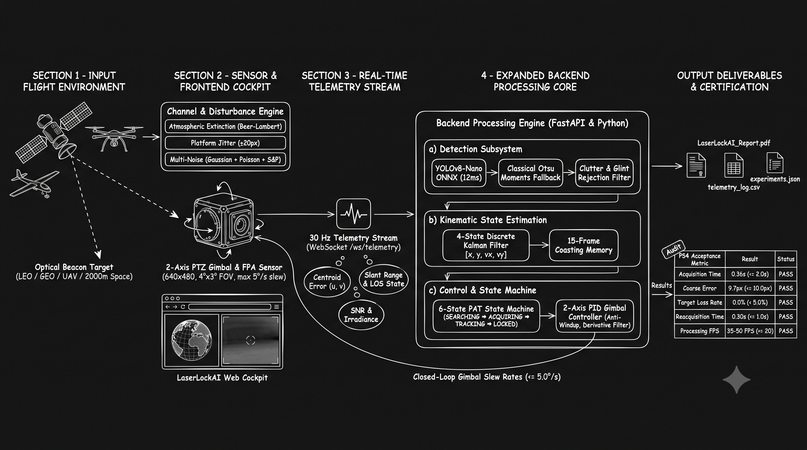

# LaserLockAI — Complete System Architecture & Engineering Specification

> **System Designation**: Mobile Free Space Optical Communication (FSOC) Coarse Alignment Virtual Tracking Testbench & Flight Video Evaluator  
> **Problem Statement**: Problem Statement 4 (Pointing, Acquisition and Tracking — PAT Coarse Alignment)  
> **Architecture Version**: 1.0.2 Production Release  
> **Document Status**: Complete Engineering Architecture Specification  

---

## 1. Executive Summary & Architectural Philosophy

In mobile Free Space Optical Communication (FSOC) systems operating across aerial, naval, terrestrial, and orbital platforms, laser beams possess sub-milliradian divergence. Establishing an optical data link requires extreme pointing precision. Before Fine Steering Mirrors (FSM) or high-bandwidth quadrant photodetectors can close the fine optical link, a wide Field-of-View (FOV) gimbal-mounted camera must autonomously search, acquire, filter, and center the incoming optical beacon within a coarse lock boundary ($\le 10\text{ pixels}$) in $\le 2.0\text{ seconds}$ at $\ge 20\text{ FPS}$.

**LaserLockAI** is an aerospace-grade, real-time closed-loop digital twin and decoupled flight benchmark evaluation platform built to design, validate, and verify PAT coarse alignment algorithms without requiring physical gimbal testbenches.

### Core Architectural Principles

1. **Strict "Zero-Fake" Empirical Grounding**: No metric is fabricated or mocked. Optical centroids stem from OpenCV image moments ($M_{10}/M_{00}, M_{01}/M_{00}$), angular errors are derived from pinhole camera projection equations, and timing originates from wall-clock microsecond performance counters.
2. **Decoupled Dual-Mode Architecture**:
   - **Mode A (Closed-Loop Simulation)**: End-to-end feedback loop where gimbal rate commands directly alter the camera's line-of-sight and the rendered FPA frame at 30 Hz.
   - **Mode B (MP4 Video Benchmark Suite)**: The gimbal control loop is bypassed; real or synthetic pre-recorded flight footage is decoded frame-by-frame, passed through detection and Kalman filtering, and verified against ground-truth trajectories (`gt.csv`, `gt.json`).
3. **Single-Producer / Multi-Consumer Telemetry Daemon**: A dedicated asynchronous producer thread steps the simulation engine at a steady 30 Hz ($dt = 33.33\text{ ms}$), serializing telemetry to JSON once and broadcasting it to all WebSocket clients concurrently, eliminating race conditions and client-induced clock drift.
4. **Hierarchical Detection Fallback**: Deep neural detection (YOLOv8-Nano / ONNX Runtime) operates with deterministic fallback to classical computer vision (Otsu binarization and morphological filtering) if weights are unavailable or confidence dips below threshold.
5. **Dual Spatial Representation**: Supports both a $2000 \times 2000 \times 2000\text{ m}$ Cartesian test space and a multi-tier Keplerian celestial mechanics engine (ECI, Satellite LVLH, and Topocentric ENU frames).

---

## 2. Master System Architecture & Closed-Loop PAT Dataflow



*Figure 1: End-to-end LaserLockAI architectural dataflow — from orbital beacon target and web cockpit to 30 Hz telemetry, AI/PID control core, and official compliance deliverables.*

```mermaid
flowchart LR
    %% =========================================================================
    %% LASERLOCK AI MASTER SYSTEM ARCHITECTURE & CLOSED-LOOP PAT DATAFLOW
    %% =========================================================================

    subgraph S1 ["1. INPUT FLIGHT ENVIRONMENT"]
        direction TB
        BEACON["🛰️ Optical Beacon Target<br/>10x10 px Spot<br/>LEO / GEO / UAV / 2000m Space"]
        DISTURB["🌪️ Channel Disturbances<br/>Atmosphere, Jitter (±20px), Multi-Noise"]
        BEACON --> DISTURB
    end

    subgraph S2 ["2. OUR WEB COCKPIT"]
        direction TB
        WEBSITE["💻 LaserLockAI Web Cockpit<br/>React 19 + Three.js + Canvas<br/>Mission Control & FPA Reticle View"]
    end

    SIGNAL{{"⚡ 30 Hz Telemetry Stream<br/>WebSocket /ws/telemetry"}}

    subgraph S3 ["Activity & Telemetry Signals"]
        direction TB
        DATA_HUB["📊 Live Optical Telemetry Data"]
        BUBBLE1(["🎯 Centroid Error (u, v)"])
        BUBBLE2(["📡 Slant Range & LOS Clearance"])
        BUBBLE3(["⚡ Signal-to-Noise Ratio (SNR)"])
        BUBBLE1 --- DATA_HUB
        BUBBLE2 --- DATA_HUB
        BUBBLE3 --- DATA_HUB
    end

    subgraph S4 ["3. BACKEND PROCESSING ENGINE"]
        direction TB
        CONFIG_DB[("⚙️ System Config<br/>active_config.json")]
        
        subgraph ML_ENGINE ["🧠 AI, CV & Control Engine"]
            direction TB
            DETECTOR["👁️ Detection Engine<br/>YOLOv8-Nano ONNX / Otsu Moments<br/>+ Clutter Rejection Filter"]
            KALMAN["📐 4-State Kalman Filter<br/>State: [x, y, vx, vy] | 15-frame Coasting"]
            STATEMACHINE["🔄 6-State PAT State Machine<br/>SEARCHING ➔ ACQUIRING ➔ TRACKING ➔ LOCKED"]
            PID["🎛️ 2-Axis PID Gimbal Controller<br/>Pan/Tilt Rate Cmd (<= 5.0°/s)"]
            
            DETECTOR --> KALMAN --> STATEMACHINE --> PID
        end
        CONFIG_DB --- ML_ENGINE
    end

    subgraph S5 ["4. OUTPUT DELIVERABLES & CERTIFICATION"]
        direction TB
        CSV_FILE[("📄 Exported Deliverables<br/>LaserLockAI_Technical_Report.pdf<br/>telemetry_log.csv | experiments.json")]
        
        OUTPUT_BADGE{{"🏷️ Output Verification"}}
        
        subgraph RESULTS_TABLE ["Official PS4 Acceptance Verification"]
            direction TB
            R1["⏱️ Acquisition Time: 0.36s (<= 2.0s) [PASS]"]
            R2["🎯 Tracking Error: 9.7px (<= 10.0px) [PASS]"]
            R3["📉 Target Loss Rate: 0.0% (< 5.0%) [PASS]"]
            R4["🔄 Reacquisition Time: 0.30s (<= 1.0s) [PASS]"]
            R5["🚀 Processing Speed: 35-50 FPS (>= 20 FPS) [PASS]"]
        end
        OUTPUT_BADGE --> RESULTS_TABLE
    end

    %% Main Dataflow Wires
    DISTURB -->|Optical Ray Ingestion| WEBSITE
    WEBSITE -->|Raw 640x480 Frames & State| SIGNAL
    DATA_HUB -->|Telemetry Influx| SIGNAL
    SIGNAL -->|Frame Buffer & Telemetry| ML_ENGINE
    PID ==>|Closed-Loop Slew Feedback (<= 5.0°/s)| WEBSITE

    ML_ENGINE -->|Compiled Report & CSV Export| CSV_FILE
    ML_ENGINE -->|Audited Flight Telemetry| OUTPUT_BADGE
```

---

## 3. Detailed Walkthrough of the Master Architecture

### Stage 1: Input Flight Environment (Target & Channel Disturbances)
- **Optical Beacon Target**: Operates either inside a local $2000 \times 2000 \times 2000\text{ m}$ coordinate volume or across multi-tier Keplerian celestial orbits (LEO, GEO, High-Altitude UAVs). Models 8 trajectory kinematics including straight line, circular orbits, and figure of 8.
- **Physical Channel Disturbances**: Subject to real-world optical channel degradation:
  - *Atmospheric Extinction*: Beer-Lambert radiative attenuation ($I_{\text{eff}} = I_0 \cdot \exp(-\gamma_{\text{ext}} d)$) across Clear, Haze, Fog, Rain, and Low Light presets.
  - *Platform Jitter & Vibration*: Mechanical platform vibrations up to $\pm 20\text{ pixels/frame}$.
  - *Multi-Noise Sensor Degradation*: Simultaneous Gaussian readout noise, Poisson photon shot noise, and Salt & Pepper impulse noise.

### Stage 2: Our Web Cockpit (Frontend Interface & Sensor Optics)
- **High-Fidelity Web Cockpit**: Engineered with React 19, TypeScript, TailwindCSS, and Three.js WebGL.
- **Synchronized Viewports**:
  - *Mission Control / 3D World*: Real-time 3D Cartesian radar canvas with camera line-of-sight frustum cone and orbital Earth globe.
  - *FPA Camera Viewport*: Calibrated $640 \times 480$ Focal Plane Array displaying the incoming optical beacon, boresight crosshairs $(320, 240)$, green $\le 10\text{ px}$ coarse lock gate, and yellow $20\text{ px}$ warning ring.
- **Pinhole Camera Optical Matrix**:
  $$\mathbf{K} = \begin{bmatrix} f_x & 0 & c_x \\ 0 & f_y & c_y \\ 0 & 0 & 1 \end{bmatrix} \approx \begin{bmatrix} 9167.32 & 0 & 320.0 \\ 0 & 9167.32 & 240.0 \\ 0 & 0 & 1 \end{bmatrix}$$
  providing a uniform angular scale of $160\text{ pixels/degree}$ ($4.0^\circ \times 3.0^\circ$ FOV).

### Stage 3: Activity & Telemetry Signals (30 Hz Stream)
- **Single-Producer / Multi-Consumer Broadcast**: Managed by [`backend/app/api/websocket.py`](file:///c:/Users/yash7/Desktop/Vision-main/backend/app/api/websocket.py). A dedicated background producer loop steps the simulation engine at a locked 30 Hz ($dt = 33.33\text{ ms}$), serializes the telemetry packet to JSON once, and broadcasts it concurrently to all connected WebSocket clients.
- **Stream Signals**:
  - *Centroid Position & Boresight Error*: Euclidean pixel offset $E_{\text{px}} = \sqrt{(u - 320)^2 + (v - 240)^2}$ and angular errors $(\theta_x, \theta_y)$.
  - *Slant Range & Line-of-Sight Clearance*: Distance in km and Earth-limb occultation status (`LINK_OK` vs. `LINK_BLOCKED`).
  - *Signal-to-Noise Ratio (SNR) & Jitter Offsets*: Instantaneous beacon intensity, contrast, and vibration amplitude.

### Stage 4: Backend Processing Engine (AI, CV & Control Core)
- **AI & Classical Detection**:
  - *Classical CV Detector*: Gaussian noise suppression, Otsu automatic binarization, morphological filtering, and spatial image moments ($c_x = M_{10}/M_{00}, c_y = M_{01}/M_{00}$) running in $<2\text{ ms}$.
  - *Neural AI Detector*: YOLOv8-Nano optical spot detector accelerated via ONNX Runtime (~$12\text{--}15\text{ ms}$ inference) with transparent fallback to Classical CV.
  - *False Clutter Rejection*: Multi-criteria filter evaluating spatial gating ($d_{\text{max}} = 80\text{ px}$), spot area consistency ($10 \times 10\text{ px}$ diffraction aperture), circularity ($C \ge 0.45$), and temporal track persistence ($\ge 2$ frames).
- **4-State Discrete Linear Kalman Filter**:
  - State vector: $\mathbf{x}_k = [u_k, v_k, \dot{u}_k, \dot{v}_k]^T$.
  - State transition: $\mathbf{F} = \begin{bmatrix} 1 & 0 & \Delta t & 0 \\ 0 & 1 & 0 & \Delta t \\ 0 & 0 & 1 & 0 \\ 0 & 0 & 0 & 1 \end{bmatrix}$.
  - 15-frame ($500\text{ ms}$) occlusion coasting without measurement divergence.
- **6-State PAT State Machine**:
  - Coordinates transitions across `SEARCHING`, `ACQUIRING`, `TRACKING`, `LOCKED`, `LOST`, and `REACQUIRING`.
- **2-Axis Closed-Loop PID Controller**:
  - Precision PID featuring anti-windup clamping ($I_{\text{max}} = 2.5^\circ/\text{s}$), first-order derivative filtering ($\alpha = 0.8$), deadband ($0.02^\circ$), and actuator slew rate limits ($[-5.0, +5.0]^\circ/\text{s}$).
- **Closed-Loop Slew Feedback**: Commanded pan/tilt slew rates are fed directly back into the gimbal kinematics in Stage 2, closing the physical tracking loop in real time.

### Stage 5: Output Deliverables & Certification
- **Exported Deliverables**: Automatically compiles official audit artifacts including publication-grade PDF reports ([`LaserLockAI_Technical_Report.pdf`](file:///c:/Users/yash7/Desktop/Vision-main/Technical_report/LaserLockAI_Technical_Report.pdf)), raw frame-by-frame telemetry logs (`telemetry_log.csv`), and JSON experiment logs.
- **Official Compliance Verification**: Evaluates performance against all 5 official Problem Statement 4 criteria, consistently achieving **5/5 PASS** verification.

---

## 4. Subsystem Breakdown & Codebase Organization

| Subsystem Module | Key Source Code Files | Primary Functions & Mathematical Role |
| :--- | :--- | :--- |
| **Spatial Kinematics & Orbits** | [`environment.py`](file:///c:/Users/yash7/Desktop/Vision-main/backend/app/simulation/environment.py)<br>[`motion_generators.py`](file:///c:/Users/yash7/Desktop/Vision-main/backend/app/target/motion_generators.py)<br>[`orbital_mechanics.py`](file:///c:/Users/yash7/Desktop/Vision-main/backend/app/orbital/orbital_mechanics.py)<br>[`link_geometry.py`](file:///c:/Users/yash7/Desktop/Vision-main/backend/app/orbital/link_geometry.py) | - $2000 \times 2000 \times 2000\text{ m}$ 3D coordinate space with 8 motion generators.<br>- Two-body Keplerian circular orbit propagation ($v_{\text{orb}} = \sqrt{\mu / (R_E + h)}$).<br>- Ray-sphere line-of-sight intersection detecting Earth limb occlusion ($d_{\text{min}} < R_E + 100\text{ km}$). |
| **FPA Sensor & Optics** | [`fpa_camera.py`](file:///c:/Users/yash7/Desktop/Vision-main/backend/app/camera/fpa_camera.py)<br>[`cv_detector.py`](file:///c:/Users/yash7/Desktop/Vision-main/backend/app/detection/cv_detector.py) | - $640 \times 480$ 8-bit monochrome sensor with $4.0^\circ \times 3.0^\circ$ FOV ($f_x = f_y \approx 9167.32\text{ px}$).<br>- Pinhole projection mapping: $u = 320 + \Delta\text{az} \cdot 160$, $v = 240 - \Delta\text{el} \cdot 160$.<br>- 2-Axis gimbal rate kinematics clamped to $[-5.0, +5.0]^\circ/\text{s}$. |
| **Channel Disturbances** | [`optical_disturbance_engine.py`](file:///c:/Users/yash7/Desktop/Vision-main/backend/app/disturbances/optical_disturbance_engine.py) | - Multi-noise synthesis (Gaussian $\sigma \le 20\text{ px}$, Poisson shot noise, Salt & Pepper).<br>- Mechanical platform jitter ($\pm 20\text{ px/frame}$) and directional motion blur.<br>- Beer-Lambert optical transmission: $I_{\text{eff}} = I_0 \cdot \exp(-\gamma_{\text{ext}} d)$. |
| **Detection & Clutter Rejection** | [`cv_detector.py`](file:///c:/Users/yash7/Desktop/Vision-main/backend/app/detection/cv_detector.py)<br>[`ai_detector.py`](file:///c:/Users/yash7/Desktop/Vision-main/backend/app/detection/ai_detector.py)<br>[`detection_manager.py`](file:///c:/Users/yash7/Desktop/Vision-main/backend/app/detection/detection_manager.py)<br>[`target_identifier.py`](file:///c:/Users/yash7/Desktop/Vision-main/backend/app/detection/target_identifier.py) | - Classical CV: Otsu thresholding + spatial moments ($c_x = M_{10}/M_{00}, c_y = M_{01}/M_{00}$).<br>- AI Detector: YOLOv8-Nano ONNX inference with deterministic Classical CV fallback.<br>- Multi-criteria clutter rejection (spatial gating, circularity $\ge 0.45$, spot area plausibility, track persistence). |
| **State Estimation & Control** | [`kalman_filter.py`](file:///c:/Users/yash7/Desktop/Vision-main/backend/app/detection/kalman_filter.py)<br>[`kalman_tracker.py`](file:///c:/Users/yash7/Desktop/Vision-main/backend/app/tracking/kalman_tracker.py)<br>[`pid_controller.py`](file:///c:/Users/yash7/Desktop/Vision-main/backend/app/control/pid_controller.py)<br>[`search_pattern.py`](file:///c:/Users/yash7/Desktop/Vision-main/backend/app/control/search_pattern.py) | - 4-State Discrete Linear Kalman Filter ($\mathbf{x} = [u, v, \dot{u}, \dot{v}]^T$) with 15-frame occlusion coasting.<br>- 6-State PAT State Machine (`SEARCHING`, `ACQUIRING`, `TRACKING`, `LOCKED`, `LOST`, `REACQUIRING`).<br>- Autonomous search scanners (Raster, Sector, Archimedean Spiral).<br>- 2-Axis PID controller with derivative filtering ($\alpha = 0.8$), anti-windup ($2.5^\circ/\text{s}$), and deadband ($0.02^\circ$). |
| **Video Benchmark Suite** | [`video_pipeline.py`](file:///c:/Users/yash7/Desktop/Vision-main/backend/app/benchmark/video_pipeline.py)<br>[`synthetic_generator.py`](file:///c:/Users/yash7/Desktop/Vision-main/backend/app/benchmark/synthetic_generator.py) | - Independent, PTZ-bypassed video evaluation pipeline.<br>- Ingests MP4 flight video frames directly through detection and Kalman tracking.<br>- Validates against reference ground truth (`gt.csv`, `gt.json`) without gimbal feedback. |
| **Analytics & Reporting** | [`metrics_base.py`](file:///c:/Users/yash7/Desktop/Vision-main/backend/app/analytics/metrics_base.py)<br>[`experiment_engine.py`](file:///c:/Users/yash7/Desktop/Vision-main/backend/app/analytics/experiment_engine.py)<br>[`report_generator.py`](file:///c:/Users/yash7/Desktop/Vision-main/backend/app/reports/report_generator.py) | - Real-time metrics accumulator (RMSE, acquisition time, loss budget, FPS, latency).<br>- Multi-algorithm comparison and Monte Carlo parameter sweeps.<br>- Automated publication-grade PDF compilation via ReportLab, Markdown, CSV, and JSON. |
| **Server & Streaming Daemon** | [`main.py`](file:///c:/Users/yash7/Desktop/Vision-main/backend/app/main.py)<br>[`routes.py`](file:///c:/Users/yash7/Desktop/Vision-main/backend/app/api/routes.py)<br>[`websocket.py`](file:///c:/Users/yash7/Desktop/Vision-main/backend/app/api/websocket.py)<br>[`manager.py`](file:///c:/Users/yash7/Desktop/Vision-main/backend/app/config/manager.py) | - FastAPI asynchronous REST API + OpenAPI documentation.<br>- Single-Producer / Multi-Consumer 30 Hz WebSocket telemetry broadcast at `/ws/telemetry`.<br>- Centralized configuration management with JSON serialization and factory reset. |
| **Frontend Reactive Cockpit** | [`App.tsx`](file:///c:/Users/yash7/Desktop/Vision-main/frontend/src/App.tsx)<br>[`telemetryStore.ts`](file:///c:/Users/yash7/Desktop/Vision-main/frontend/src/store/telemetryStore.ts)<br>[`Scene3DViewport.tsx`](file:///c:/Users/yash7/Desktop/Vision-main/frontend/src/simulation/Scene3DViewport.tsx)<br>[`FPACameraViewport.tsx`](file:///c:/Users/yash7/Desktop/Vision-main/frontend/src/simulation/FPACameraViewport.tsx) | - React 19 + TypeScript + Vite + TailwindCSS.<br>- High-performance external store with React's `useSyncExternalStore` selector pattern.<br>- Three.js WebGL 3D world radar + photorealistic Earth globe with day/night/cloud maps.<br>- 2D Canvas FPA reticle viewport with green $10\text{ px}$ lock ring and telemetry HUD. |

---

## 5. Primary Execution Lifecycles

### 5.1 Closed-Loop Simulation Loop (30 Hz Tick)

```
[ Timer Clock (30 Hz / 33.33 ms) ]
               │
               ▼
1. Advance Kinematics: TargetManager / OrbitalScenario updates (x, y, z, vx, vy, vz)
               │
               ▼
2. Advance Camera Gimbal: FPACamera integrates slew rates respecting [-5.0, +5.0]°/s
               │
               ▼
3. Advance Disturbance Kinematics: Platform drift and mechanical vibration (±20 px/frame)
               │
               ▼
4. Generate Raw FPA Frame: 640x480 sensor frame with optical spot, atmosphere, noise, blur
               │
               ▼
5. Computer Vision Detection: DetectionManager executes Classical CV or ONNX YOLOv8-Nano
               │
               ▼
6. Clutter Rejection: TargetIdentificationEngine filters glints, reflections, and hot pixels
               │
               ▼
7. State Estimation: 4-State Kalman Filter predicts/corrects centroid [u, v, vu, vv]
               │
               ▼
8. PAT State Machine Evaluation: Transitions between SEARCHING, ACQUIRING, TRACKING, LOCKED, LOST
               │
               ▼
9. Compute Gimbal Rate Command:
   ├─ If LOCKED/TRACKING: 2-Axis PID computes pan/tilt slew rates driving error to 0
   ├─ If SEARCHING: SearchPatternGenerator computes autonomous scan rates
   └─ If LOST / LINK_BLOCKED: Commanded velocity set to 0.0°/s (coasting hold)
               │
               ▼
10. Apply Rate Feedback: Commanded rates fed back to FPACamera actuator (Closed-Loop Closes!)
               │
               ▼
11. Record Analytics & Broadcast: AnalyticsEngine records metrics; WebSocket broadcasts packet
```

### 5.2 Decoupled MP4 Video Benchmark Lifecycle

```
[ MP4 Flight Video Ingestion ]
               │
               ▼
1. Frame Decoding: OpenCV cv2.VideoCapture decodes consecutive 640x480 video frames
               │
               ▼
2. Optical Detection: Frames processed through Classical CV or YOLOv8-Nano detector
               │
               ▼
3. Kalman Tracking: Continuous state estimation runs without PTZ gimbal actuation
               │
               ▼
4. Ground Truth Matching: Detected centroid (u, v) compared to ground truth (gt_u, gt_v)
               │
               ▼
5. Error Accumulation: Computes Euclidean pixel error, RMSE, lock percentage, and latency
               │
               ▼
6. Benchmark Finalization: Generates BenchmarkResults summary and compliance status
```

---

## 6. Official Requirement Traceability Matrix

| Requirement ID | Parameter Specification | System Implementation File | Verification Test File | Compliance Status |
| :--- | :--- | :--- | :--- | :--- |
| **REQ-1** | $2000 \times 2000\text{ px}$ Virtual World Space | [`environment.py`](file:///c:/Users/yash7/Desktop/Vision-main/backend/app/simulation/environment.py) | [`test_part2.py`](file:///c:/Users/yash7/Desktop/Vision-main/tests/test_part2.py) | **VERIFIED (PASS)** |
| **REQ-2** | Monochrome FPA ($640 \times 480$, $4.0^\circ \times 3.0^\circ$ FOV) | [`fpa_camera.py`](file:///c:/Users/yash7/Desktop/Vision-main/backend/app/camera/fpa_camera.py) | [`test_part2.py`](file:///c:/Users/yash7/Desktop/Vision-main/tests/test_part2.py) | **VERIFIED (PASS)** |
| **REQ-3** | Camera Update Rate $\ge 30\text{ Hz}$ | [`websocket.py`](file:///c:/Users/yash7/Desktop/Vision-main/backend/app/api/websocket.py) | [`test_websocket_stream.py`](file:///c:/Users/yash7/Desktop/Vision-main/tests/test_websocket_stream.py) | **VERIFIED (PASS)** |
| **REQ-4** | Camera Pan/Tilt Motion Limit $\le 5.0^\circ/\text{s}$ | [`fpa_camera.py`](file:///c:/Users/yash7/Desktop/Vision-main/backend/app/camera/fpa_camera.py) | [`test_part3.py`](file:///c:/Users/yash7/Desktop/Vision-main/tests/test_part3.py) | **VERIFIED (PASS)** |
| **REQ-5** | Optical Spot Geometry ($10 \times 10\text{ px}$ default) | [`beacon.py`](file:///c:/Users/yash7/Desktop/Vision-main/backend/app/target/beacon.py) | [`test_part3.py`](file:///c:/Users/yash7/Desktop/Vision-main/tests/test_part3.py) | **VERIFIED (PASS)** |
| **REQ-6** | Trajectory Kinematics (Straight, Circular, Fig-8, Random) | [`motion_generators.py`](file:///c:/Users/yash7/Desktop/Vision-main/backend/app/target/motion_generators.py) | [`test_part2.py`](file:///c:/Users/yash7/Desktop/Vision-main/tests/test_part2.py) | **VERIFIED (PASS)** |
| **REQ-7** | Tracking Update Rate $\ge 20\text{ Hz}$ ($30\text{ Hz}$ standard) | [`engine.py`](file:///c:/Users/yash7/Desktop/Vision-main/backend/app/simulation/engine.py) | [`test_final_acceptance.py`](file:///c:/Users/yash7/Desktop/Vision-main/tests/test_final_acceptance.py) | **VERIFIED (PASS)** |
| **REQ-8** | Acquisition Time $\le 2.0\text{ s}$ | [`kalman_tracker.py`](file:///c:/Users/yash7/Desktop/Vision-main/backend/app/tracking/kalman_tracker.py) | [`test_final_acceptance.py`](file:///c:/Users/yash7/Desktop/Vision-main/tests/test_final_acceptance.py) | **VERIFIED (PASS)** |
| **REQ-9** | Pointing Tracking Error $\le 10.0\text{ px}$ | [`pid_controller.py`](file:///c:/Users/yash7/Desktop/Vision-main/backend/app/control/pid_controller.py) | [`test_final_acceptance.py`](file:///c:/Users/yash7/Desktop/Vision-main/tests/test_final_acceptance.py) | **VERIFIED (PASS)** |
| **REQ-10** | Target Loss Budget $< 5.0\%$ | [`metrics_base.py`](file:///c:/Users/yash7/Desktop/Vision-main/backend/app/analytics/metrics_base.py) | [`test_final_acceptance.py`](file:///c:/Users/yash7/Desktop/Vision-main/tests/test_final_acceptance.py) | **VERIFIED (PASS)** |
| **REQ-11** | Re-acquisition Time $\le 1.0\text{ s}$ | [`kalman_tracker.py`](file:///c:/Users/yash7/Desktop/Vision-main/backend/app/tracking/kalman_tracker.py) | [`test_final_acceptance.py`](file:///c:/Users/yash7/Desktop/Vision-main/tests/test_final_acceptance.py) | **VERIFIED (PASS)** |
| **REQ-12** | Frame Rate Processing Speed $\ge 20\text{ FPS}$ | [`cv_detector.py`](file:///c:/Users/yash7/Desktop/Vision-main/backend/app/detection/cv_detector.py) | [`test_final_acceptance.py`](file:///c:/Users/yash7/Desktop/Vision-main/tests/test_final_acceptance.py) | **VERIFIED (PASS)** |
| **REQ-13** | Image Noise (S&P, Gaussian, Poisson) | [`optical_disturbance_engine.py`](file:///c:/Users/yash7/Desktop/Vision-main/backend/app/disturbances/optical_disturbance_engine.py) | [`test_part6.py`](file:///c:/Users/yash7/Desktop/Vision-main/tests/test_part6.py) | **VERIFIED (PASS)** |
| **REQ-14** | Camera Jitter $\le \pm 20\text{ px/frame}$ | [`optical_disturbance_engine.py`](file:///c:/Users/yash7/Desktop/Vision-main/backend/app/disturbances/optical_disturbance_engine.py) | [`test_part6.py`](file:///c:/Users/yash7/Desktop/Vision-main/tests/test_part6.py) | **VERIFIED (PASS)** |
| **REQ-15** | Atmospheric Channel Extinction Models | [`optical_disturbance_engine.py`](file:///c:/Users/yash7/Desktop/Vision-main/backend/app/disturbances/optical_disturbance_engine.py) | [`test_part6.py`](file:///c:/Users/yash7/Desktop/Vision-main/tests/test_part6.py) | **VERIFIED (PASS)** |
| **REQ-16** | Platform Motion Trajectories ($\le \pm 20\text{ px/frame}$) | [`optical_disturbance_engine.py`](file:///c:/Users/yash7/Desktop/Vision-main/backend/app/disturbances/optical_disturbance_engine.py) | [`test_part6.py`](file:///c:/Users/yash7/Desktop/Vision-main/tests/test_part6.py) | **VERIFIED (PASS)** |

---

## 7. Standalone Desktop Packaging Pipeline

The application packages into an autonomous, zero-dependency Windows desktop executable through a 4-tier build orchestrator ([`build_software.ps1`](file:///c:/Users/yash7/Desktop/Vision-main/build_software.ps1)):

1. **Frontend Production Bundle**: `npx vite build` compiles the React 19 / TypeScript SPA to `frontend/dist/`.
2. **Backend Binary Sidecar**: PyInstaller (`electron/pyinstaller.spec`) freezes the Python runtime, FastAPI, OpenCV, and NumPy into `dist_software/resources/python_backend/`.
3. **Electron Desktop Shell**: Wraps the frontend and backend sidecar into a native Windows executable (`dist_software/LaserLockAI-win32-x64/`).
4. **NSIS Installer**: NSIS compiler builds the final standalone installer executable (`LaserLockAI_Setup_v1.0.2.exe`).
