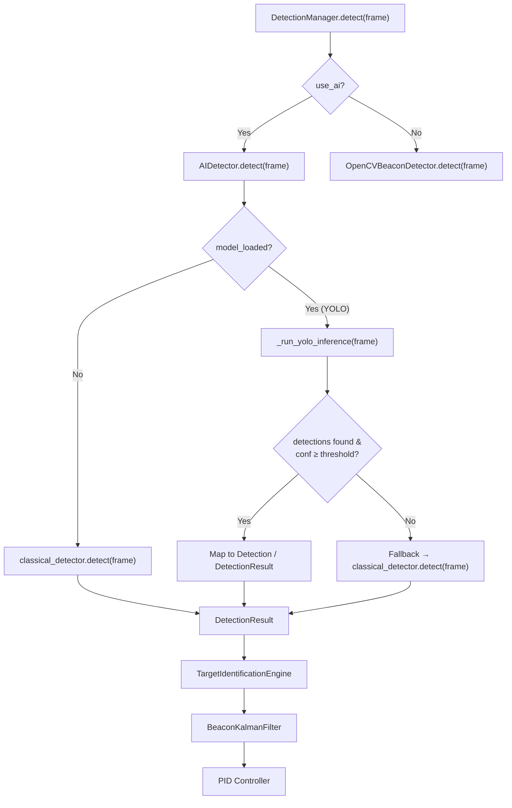

# YOLOv8-Nano Integration Plan

## Architecture Overview



---

## Files Changed

| File | Change |
|---|---|
| [`requirements.txt`](file:///c:/Users/yash7/Desktop/Vision-main/requirements.txt) | Add `ultralytics>=8.0.0` |
| [`backend/app/detection/ai_detector.py`](file:///c:/Users/yash7/Desktop/Vision-main/backend/app/detection/ai_detector.py) | **Primary target** — rewrite to use `ultralytics` YOLO |
| [`backend/app/models/config_model.py`](file:///c:/Users/yash7/Desktop/Vision-main/backend/app/models/config_model.py) | Update `model_weights_path` default → `ML_model/my_model.pt` |

> [!IMPORTANT]
> **Zero changes** to `detection_manager.py`, `detector_base.py`, `cv_detector.py`, `kalman_filter.py`, or `target_identifier.py`. The existing orchestration, Kalman filter, PID loops, and telemetry pipeline remain untouched.

---

## Step-by-Step Plan

### Step 1 — Add `ultralytics` dependency
Add `ultralytics>=8.0.0` to [`requirements.txt`](file:///c:/Users/yash7/Desktop/Vision-main/requirements.txt) so the YOLO model can be loaded via `from ultralytics import YOLO`.

### Step 2 — Update default `model_weights_path`
In [`config_model.py`](file:///c:/Users/yash7/Desktop/Vision-main/backend/app/models/config_model.py#L97-L99), change the default value from `models/yolov8_beacon.onnx` to `ML_model/my_model.pt` so the system auto-discovers your trained weights without manual config.

### Step 3 — Rewrite `AIDetector.__init__` (one-time model load)
Replace `cv2.dnn.readNet` with `ultralytics.YOLO`:

```python
from ultralytics import YOLO

def _init_model(self):
    if weights_path and os.path.isfile(weights_path):
        self.yolo_model = YOLO(weights_path)  # loaded ONCE
        self.model_loaded = True
```

- **Key constraint**: The `YOLO()` constructor is called exactly once in `__init__` → `_init_model()`. The model object is stored as `self.yolo_model` and reused for every frame.
- **Device routing**: `self.yolo_model.to("cuda")` if GPU is configured, otherwise CPU.

### Step 4 — Rewrite `_run_neural_inference` for ultralytics output
Replace the `cv2.dnn` blob/forward pipeline with:

```python
results = self.yolo_model(frame, verbose=False)
```

Parse the ultralytics `Results` object:
1. Extract all bounding boxes from `results[0].boxes`
2. Filter by `confidence >= ai_confidence_threshold`
3. Sort by confidence descending
4. For the **highest-confidence** box, calculate centroid: `cx = x1 + w/2`, `cy = y1 + h/2`
5. Map each qualifying box to a `Detection` dataclass

### Step 5 — Implement deterministic fallback in `detect()`
Add a **third case** in the `detect()` method:

```
CASE A: model_loaded=True AND YOLO returns detections → use YOLO output
CASE B: model_loaded=True BUT YOLO returns nothing above threshold → fallback to classical_detector
CASE C: model_loaded=False → fallback to classical_detector (existing)
```

This guarantees the Kalman filter and PID loop always receive a valid `DetectionResult` — either from YOLO or from the classical tracker. The downstream pipeline is completely unaware of which source produced the measurement.

### Step 6 — Verify downstream compatibility

The `DetectionResult` output contract is **identical** regardless of source:

| Field | YOLO Source | Classical Fallback |
|---|---|---|
| `primary_detection.centroid_x` | Bbox center x | Moment centroid x |
| `primary_detection.centroid_y` | Bbox center y | Moment centroid y |
| `primary_detection.confidence` | YOLO score | CV heuristic score |
| `primary_detection.bbox` | `[x, y, w, h]` | `[x, y, w, h]` |
| `active_method` | `"AI Detector (YOLOv8-Nano…)"` | `"AI Detector (Standby…)"` |
| `model_loaded` | `True` | `False` |

→ `DetectionManager` passes this to `TargetIdentificationEngine` → `BeaconKalmanFilter` → PID without any code changes.

---

## Risk Mitigations

| Risk | Mitigation |
|---|---|
| Model file missing at startup | Graceful fallback + log warning — identical to current behavior |
| YOLO inference latency > frame budget | `ultralytics` YOLOv8-Nano runs ~2-5ms on CPU @ 640×480 — well within 33ms budget |
| Low-confidence / no detections | Explicit threshold gate → classical fallback per-frame |
| `ultralytics` import failure | `try/except ImportError` → sets `model_loaded=False`, logs warning |

---

> [!TIP]
> After applying the changes, install the new dependency:
> ```bash
> pip install ultralytics>=8.0.0
> ```
